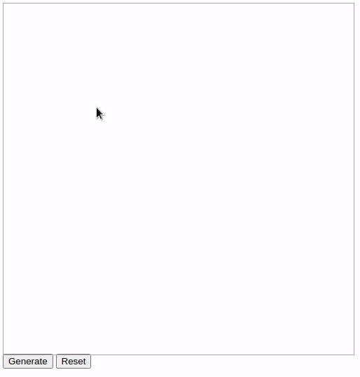

# kd-Tree
## Example Application

 
*Shows an application to select elements within a user defined boundary*
## About
* A data structure that partitions the space storing element position information. Also called fancily as "***spatial indexing***"

* Widely used for range search and to find nearest neighbours.

* Application includes gaming, astronomy, and machine learning.

* This repository contains implementation of kd-tree but for two dimension, and acts like an example for any `k` dimensions; only have to change the logic to switch the axis.

* The index page (example above) shows the use of this data stucture in finding  the elements found in a defined 2d boundary. 

* This implementation was used internally as part of a solution to create a custom React component detecting number of elements within a window boundary for my internship. 

## Build
* Simply install the essential packages.
`npm install`
* To run enter `npm run start`